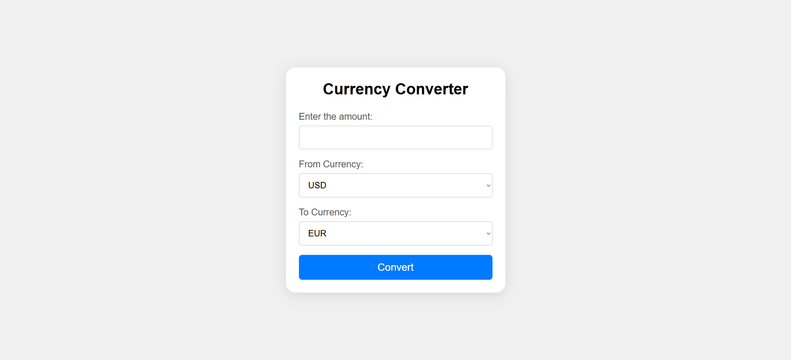

📝 README.md
md
Copy
Edit
# Currency Converter (PHP)

This is a simple and beginner-friendly currency converter built with PHP and HTML. It allows users to convert an amount between USD, EUR, and GBP using predefined exchange rates.

## 🔧 Features

- Converts between USD, EUR, and GBP
- Clean and simple user interface
- Uses PHP to process form data and calculate conversion
- Styled with basic CSS (embedded in file)

## 📷 Screenshot

## 🚀 How It Works

1. Enter the amount you want to convert.
2. Choose the source currency (`From`) and the target currency (`To`).
3. Click the "Convert" button.
4. The converted amount will be displayed below the form.

## 📁 File Structure

currency-converter/
│
├── index.php # Main PHP + HTML file
├── style.css # (Optional) External CSS if separated
└── README.md # Project documentation

sql
Copy
Edit

## 💡 Example

Convert 100 USD to EUR. With the hardcoded rate of 0.85, the result will be:

Converted Amount: 85 EUR

pgsql
Copy
Edit

## 📌 Note

- This project uses hardcoded exchange rates.
- For real-time conversions, you can integrate an API like ExchangeRate-API or OpenExchangeRates.

## 🧑‍💻 Requirements

- PHP 7.x or later
- A local server (e.g., XAMPP, MAMP) or live PHP hosting

## 📜 License

This project is open-source and free to use.
